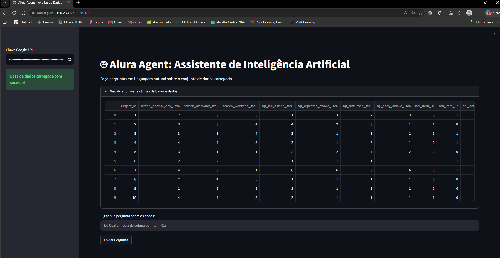
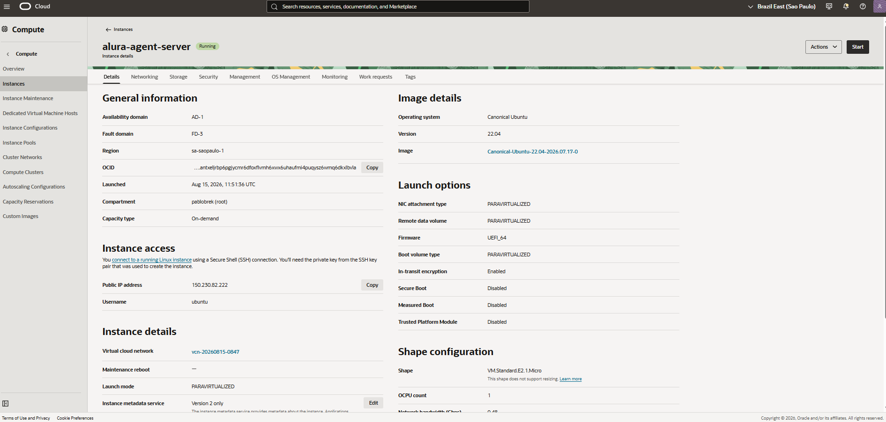
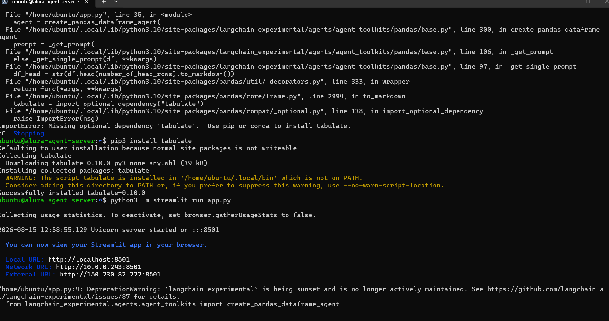

# 🤖 Alura Agent: Assistente de Inteligência Artificial para Análise de Dados


Este repositório contém a versão final do **Alura Agent**, uma aplicação interativa com interface web que utiliza Inteligência Artificial (Google Gemini) e a biblioteca LangChain para permitir que os usuários façam perguntas em linguagem natural sobre uma base de dados estruturada.

O projeto tem como base a análise de um conjunto de dados sobre tempo de tela e saúde mental (`bdi_and_screen_items.csv`), demonstrando a capacidade da IA de atuar como um analista de dados automatizado.

---

## ☁️ Status do Deploy e Arquitetura em Nuvem

> **Aviso de Desativação:** O deploy desta aplicação foi realizado com sucesso em um servidor de produção (Ubuntu 22.04) provisionado na **Oracle Cloud Infrastructure (OCI)**. A aplicação esteve ativa e acessível publicamente através da URL **`http://150.230.82.222:8501`**. Após a validação técnica, testes de firewall e captura das demonstrações para este portfólio, a instância foi intencionalmente desligada e destruída para evitar o consumo ocioso de recursos na nuvem.

O processo de deploy envolveu:

- Provisionamento de uma VM (Compute Instance) no nível _Always Free_ da OCI.
- Configuração de chaves SSH para acesso seguro e transferência de arquivos via SCP.
- Configuração de regras de rede (Ingress Rules) na VCN da Oracle e no firewall interno do Ubuntu (`iptables`) para liberar o tráfego TCP na porta 8501.

---

## 📸 Demonstração do Projeto

Abaixo estão os registros do funcionamento e da infraestrutura do projeto operando em nuvem:

### 1. Interface Web (Deploy no Ar)

A interface da aplicação rodando com sucesso no IP público do servidor, demonstrando a integração do Streamlit com o modelo Gemini.


### 2. Infraestrutura na Oracle Cloud (OCI)

Painel de controle da Oracle Cloud comprovando a criação, provisionamento e execução da máquina virtual (Instance) responsável por hospedar o agente.


### 3. Acesso e Configuração via Terminal (SSH)

Registro da conexão remota via SSH ao servidor Ubuntu, instalação das dependências Python (`pip`) e inicialização do serviço do Streamlit.


---

## 🛠️ Tecnologias Utilizadas

- **Python:** Linguagem base da aplicação.
- **Streamlit:** Framework utilizado para a construção rápida da interface de usuário (UI).
- **LangChain & LangChain Experimental:** Frameworks de orquestração para conectar a IA aos dados (Pandas DataFrame Agent).
- **Google Gemini (AI Studio):** LLM (Large Language Model) utilizado como o "cérebro" analítico do projeto (`gemini-1.5-flash`).
- **Pandas & Tabulate:** Bibliotecas para leitura, manipulação e renderização em Markdown dos dados em CSV.
- **Oracle Cloud Infrastructure (OCI):** Provedor de nuvem utilizado para o deploy e hospedagem do servidor Ubuntu.

---

## 📁 Estrutura do Repositório

````text
├── source/                      # Diretório de imagens para a documentação
│   ├── cloud-oracle.png
│   ├── site-ar.png
│   └── terminal.png
├── app.py                       # Código-fonte principal da aplicação Streamlit
├── bdi_and_screen_items.csv     # Base de dados utilizada pelo Agente
├── requirements.txt             # Lista de dependências e bibliotecas Python
└── README.md                    # Documentação do projeto

---

## 🚀 Como Executar Localmente

Se desejar clonar e rodar este projeto na sua própria máquina, siga os passos abaixo:

1. Clone o repositório:

```bash
git clone https://github.com/SEU_USUARIO/SEU_REPOSITORIO.git
cd SEU_REPOSITORIO
````

2. Instale as dependências:

```bash
pip install -r requirements.txt
```

3. Execute a aplicação:

```bash
python -m streamlit run app.py
```

4. Acesse no navegador:

O Streamlit abrirá automaticamente, mas você também pode acessar manualmente via http://localhost:8501 . Nota: É necessário possuir uma chave ativa do Google AI Studio para interagir com o agente.

Projeto desenvolvido por Pablo Henrique da Silva Andrade como parte dos desafios e aprendizados propostos na Imersão ONE (Oracle Next Education).
